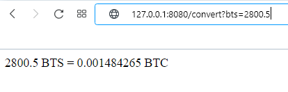
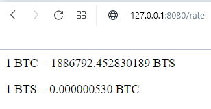

# Crypto converter

The BTC / BTS converter is being developed to show current exchange rate for these cryptocurrencies.  
## How to use
On route `host:port/convert` add parameter `btc` (for convert BTC to BTS) or `bts` 
(for convert BTS to BTC) with number like in the examples:
- http://127.0.0.1:8080/convert?btc=2
- http://127.0.0.1:8080/convert?bts=2.5
- http://127.0.0.1:8080/convert?bts=3,2

You can separate whole and fractional parts by comma or dot.

Different parameter names are supported:
- for BTS: bts, BTS, Bts, BitShares, bitshares, BITSHARES
- for BTC: btc, BTC, Btc, bitcoin, Bitcoin, BITCOIN

Example of result:

On route `host:port/rate` you can see current rate. Example:

## How to run
### Docker
- Prepare .env file. Example:
  
        PYTHONUNBUFFERED=1
        HOST=0.0.0.0
        PORT=8080
- run command `docker run --env-file .env -p "5000:8080" artempol/cryptoconverter`
### Manually
- Install python 3.8
- run `pip install -r requirements.txt`
- run `python app/app.py` with env:
  
        PYTHONUNBUFFERED=1
        HOST=127.0.0.1
        PORT=8080
- enjoy

